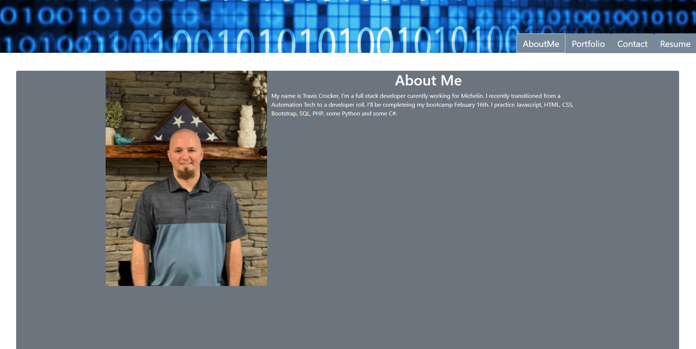

# React Portfolio
# License
 
[Deployed Site](https://tmcrocker89.github.io/ReactPortfolio/)

# Table of Contents
[Description](#description) 
[Installation](#installation) 
[Usage](#usage) 
[License](#license) 
[Contributing](#contributing) 
[Tests](#tests) 
[Questions](#questions) 
# Description
This is my portfolio, programmed in react.
# Installation
nothing to install
# Usage
View the deployed link
# Contributing
Travis Crocker
# Tests
### How to test the application.
No Tests
# Questions
### For questions contact me using the information below.
Travis.Crocker.Dev@gmail.com [github](https://Github.com/tmcrocker89)
